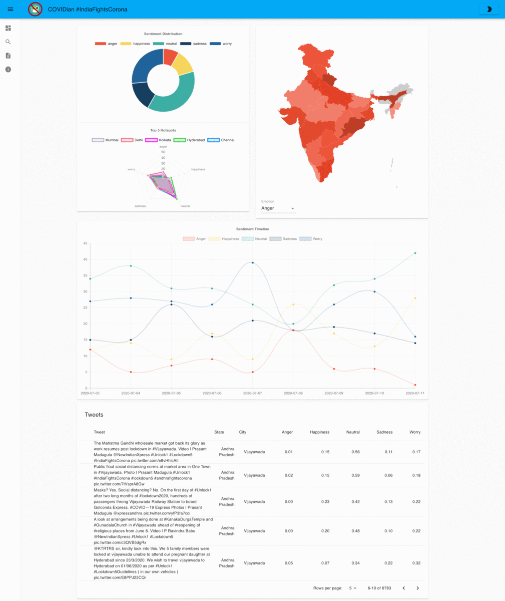
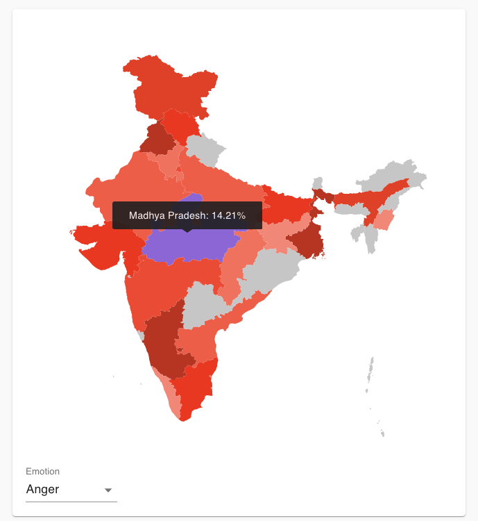
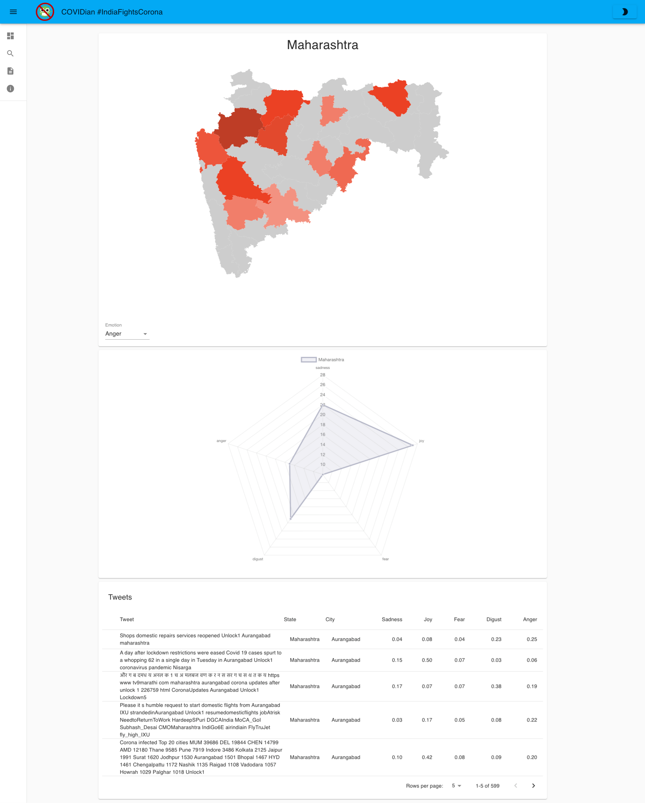
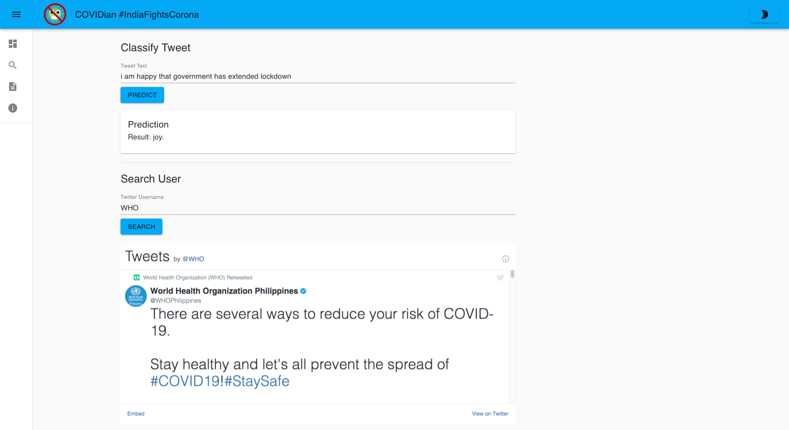
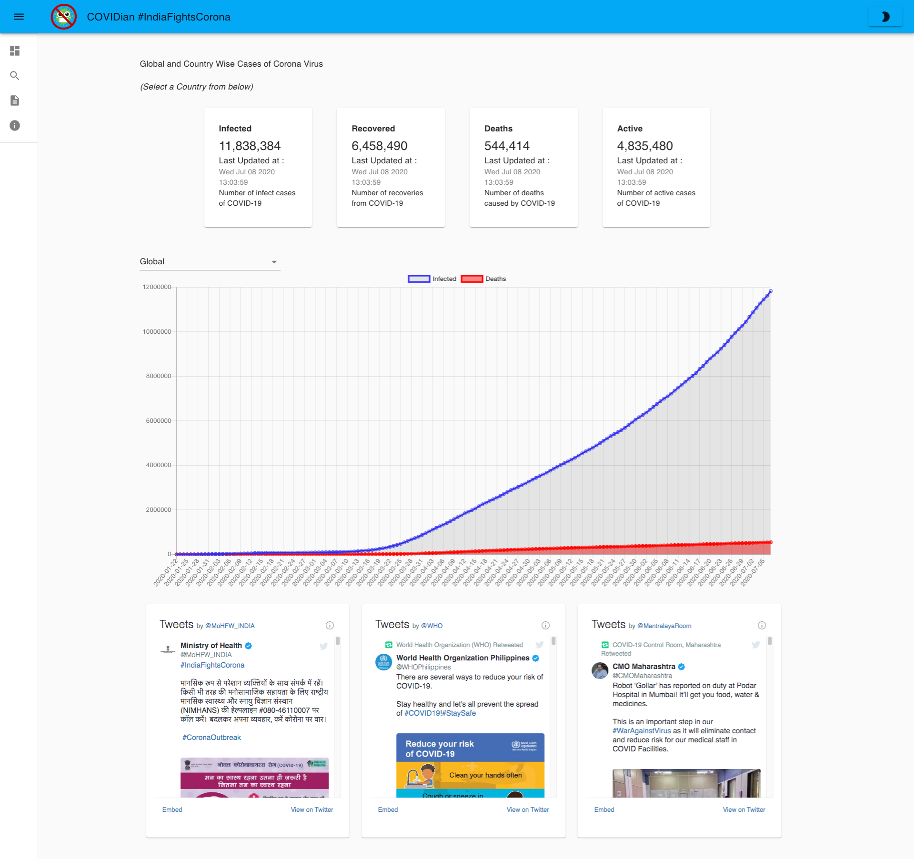

### An COVID Tweet Sentiment Visualizer and Analyser Application

## About The Project:

COVIDian offers different ways of visualizing as well as analyzing tweets.

- COVIDian is now available in dark mode!
- National-level statistics are available on the main dashboard.
  - Cumulative data on emotions are displayed in the doughnut chart, and city hotspots are displayed in the radar chart.
  - To remove a city/emotion from the chart, _simply click on it_!
  - Over 6000 tweets (and counting) and their emotion values are displayed on the main dashboard.
- **Map of India** visualizes the emotion distribution, emotion wise! Just change the emotion to view the distribution.
- Users can view state-wise information as well! Click on the state and see the results. Map of state, radar chart for emotions and, state-specific tweets will be shown. _District/City-wise distribution is in beta phase and will be out soon_
- **Tweet Analyzer** is where the real magic is at, all you have to do is put a tweet and our model will predict its emotions! To make our lives easy we have embedded twitter as well, just type the twitter handle and we fetch the tweet for you.
- To keep in touch with reality and severity of COVID-19, **Resources** tab offers you _COVID-19 tracker_. Daily updates on infected, recovered and deaths related to coronavirus can be seen here.
- **COVIDianBot** will use AI technology to understand what you are typing and will reply with the correct answer to your query.You can ask the bot the number of cases or the results of sentiment analysis.

## Dashboard

Presenting an all-in-one dashboard to visualize emotions to **coronavirus pandemic** and **government decisions** related to it,based on Twitter data.

Hovering on any state gives general information about that state.

Clicking on any state gives state-specific information. Tweets specific to the state are also seen,with their _scores on emotions_.

## Live Tweet Analyzer Page

Enter a twitter username to get a list of the users tweets. You can perform live analysis of the tweet with our trained models.

## Resources Page

Latest updates on tweets and COVID statistics can be found here.

## COVIDianBot

The bot will use AI technology to understand what you are typing and will reply with the correct answer to your query.

You can ask the bot the number of cases or the results of sentiment analysis. The bot will use AI technology to understand what you are typing and will reply with the correct answer to your query.

For now we have restricted it to States of India.

### Resources:

- [Twint](https://github.com/twintproject/twint) - Twitter scraping tool **without** the need of Twitter API

- [Node.js](https://nodejs.org/en/) - Node.js is a JavaScript runtime built on **Chrome's V8 JS engine**

- [Create a New React App](https://reactjs.org/docs/create-a-new-react-app.html) - Get started with React here

- [Material UI](https://material-ui.com/) - React components for faster and easier web development

- [Express.js](https://expressjs.com/) - A web application framework for Node.js

- [GraphQL](https://graphql.org/) - An open-source data query and manipulation language for APIs

- [Mongoose](https://mongoosejs.com/docs/) - An Object Data Modeling (ODM) library for MongoDB and Node

- [Tensorflow](https://www.tensorflow.org/) - Open source software library for Machine Learning frameworks

- [Keras](https://keras.io/) - Runs on top of tensorflow,designed to enable fast experimentation with deep neural networks

- [IBM API](https://www.ibm.com/in-en/cloud/api-connect) - Model will be hosted on IBM API

- [Docker](https://www.docker.com/) - Docker is a set of platform as a service products that uses OS-level virtualization to deliver software in packages called containers.

- [FastAPI](https://fastapi.tiangolo.com/) - FastAPI is a modern, fast (high-performance), web framework for building APIs with Python 3.6+ based on standard Python type hints.

- [Uvicorn](https://www.uvicorn.org/) - Uvicorn is a lightning-fast ASGI server, built on uvloop and httptools.

## Getting Started:

### Finished Product

[Working Website](http://ec2-18-206-241-236.compute-1.amazonaws.com:3050/)

### Development

1. Clone the repo
2. Populate the sample.env and save to .env file in the same folder as _docker-compose.yml_
3. Run `docker-compose up`
4. View [http://localhost:5000](http://localhost:5000)

## Contributing:

Contributions are what makes the open source community such an amazing place to learn, inspire, and create. Any contributions you make are **greatly appreciated**.

All you simply need to do is:

1. Fork the Project
2. Create your Feature Branch (`git checkout -b feature/AmazingFeature`)
3. Commit your Changes (`git commit -m 'Add some AmazingFeature'`)
4. Push to the Branch (`git push origin feature/AmazingFeature`)
5. Open a Pull Request

## Team Members:

| [Amogh Warkhandkar](https://github.com/amogh-w) | [Rahul Lamge](https://github.com/rlamge) | [Omkar Bhambure](https://github.com/blablabluomie) | [Ram Pandey](https://github.com/rampa2510) |
