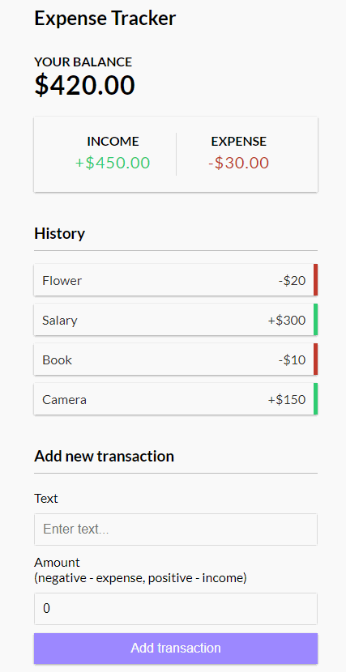

A React Web application to keep track of your transactions.

## Resources:

- [Create a New React App](https://reactjs.org/docs/create-a-new-react-app.html) - Get started with React here
- [Traversy Media Tutorial](https://www.youtube.com/watch?v=XuFDcZABiDQ) - Tutorial for this project.I

## Available Scripts:

In the project directory, you can run: `yarn start`

Open [http://localhost:3000](http://localhost:3000) to view it in the browser.

---

This project was bootstrapped with [Create React App](https://github.com/facebook/create-react-app).
