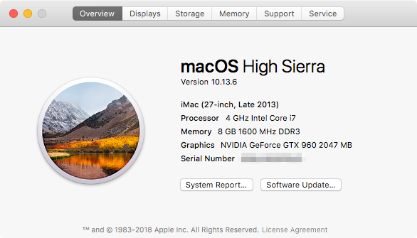
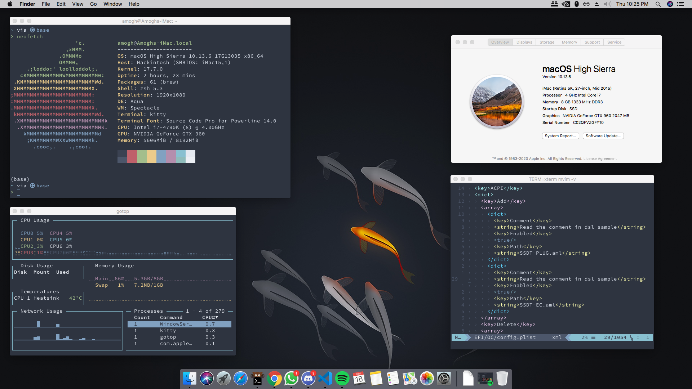

I have managed to succesfully run High Sierra 10.13.6 on my i7-4790k, Gigabyte Z97X Gaming 5 and GTX 960 with OpenCore.

Note: Don't copy over my EFI and expect it to boot. Use it as a reference and build your own while referring to the dortania OpenCore Guide linked below. Have fun!

## Resources:

- [r/Hackintosh](https://www.reddit.com/r/hackintosh/) - A subreddit to learn about Hackintosh-ing
- [OpenCore](https://github.com/acidanthera/OpenCorePkg/) - You can get the Custom Bootloader here
- [dortania OpenCore Guide](https://dortania.github.io/OpenCore-Desktop-Guide/) - Best guide available on the planet

## Kexts that I have used:

0. SMC: `VirtualSMC.kext`
1. Ethernet: `AtherosE2200Ethernet.kext`
2. USB: `USBInjectAll.kext`
3. Audio: `AppleALC.kext` with `Lilu.kext` companion
4. Graphics: `WhateverGreen.kext` with `Lilu.kext` companion

## Disclaimer

I have not created any of the above kexts. I have just picked the kexts which were needed for my system and made the necessary changes to the `config.plist` to ensure that my system runs perfectly. Thank you, the wonderful Hackintosh Community! ❤️
