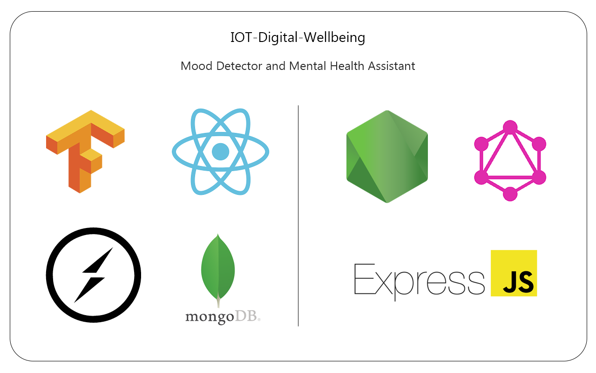
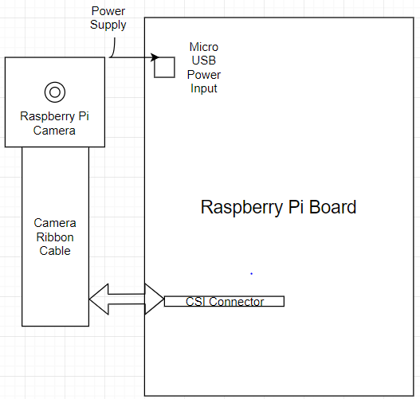
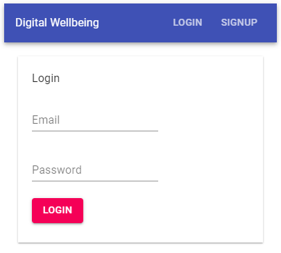
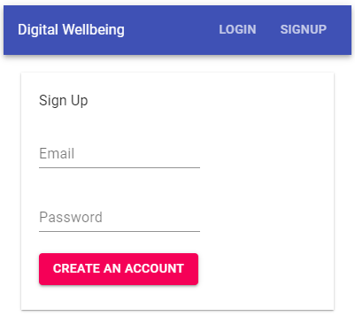
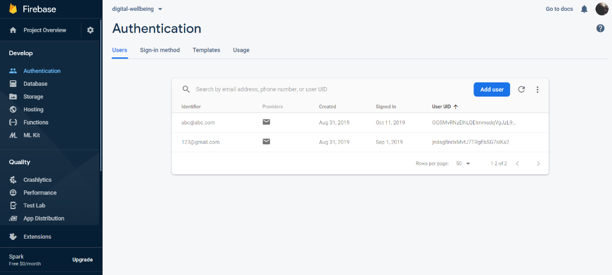
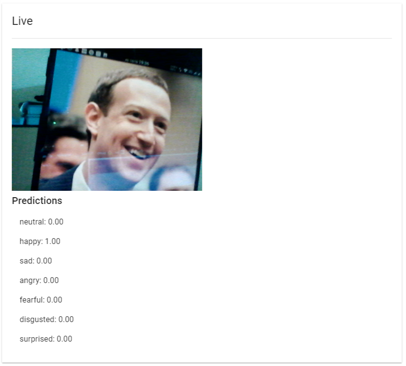

Presenting your personal Mood Detector and Mental Health Assistant. It uses React.js for frontend, while MongoDB + GraphQL as its backend. It can also work with multiple devices at the same time, primarily on the Raspberry Pi.

Proposed Block Diagram



Login Screen



Sign Up Screen



Firebase Dashboard



Live Predictions



## Schemas:

User Schema:

```
const userSchema = new Schema({
  name: String,
  age: Number
});

```

Emotion Schema:

```
const emotionSchema = new Schema({
  detectedEmotion: String,
  date: Date,
  userId: String
});
```

## Code Snippets

GraphQL Root Query:

```
const RootQuery = new GraphQLObjectType({
  name: "RootQueryType",
  fields: {
    emotion: {
      type: EmotionType,
      args: { id: { type: GraphQLID } },
      resolve(parent, args) {
        return Book.findById(args.id);
      }
    },
    user: {
      type: UserType,
      args: { id: { type: GraphQLID } },
      resolve(parent, args) {
        return User.findById(args.id);
      }
    },
    emotions: {
      type: GraphQLList(EmotionType),
      resolve(parent, args) {
        return Emotion.find({});
      }
    },
    users: {
      type: GraphQLList(UserType),
      resolve(parent, args) {
        return User.find({});
      }
    }
  }
});
```

Enabling Feed from the Webcam:

```
  const getImage = React.useCallback(() => {
    const imageSrc = webcamRef.current.getScreenshot();
    setSnapshot(imageSrc);
  }, [webcamRef]);

  socket.on("getImageRequest", () => {
    setInterval(() => {
      getImage();
      socket.emit("imageTaken", image.current);
    }, 100);
  });
```

Detecting Emotions:

```
  useEffect(() => {
    async function loadModels() {
      await faceapi.nets.tinyFaceDetector.loadFromUri("/models");
      await faceapi.nets.faceExpressionNet.loadFromUri("/models");
    }
    loadModels();
    const videoCanvas = document.getElementById("videoCanvas");
    setInterval(async () => {
      const detections = await faceapi
        .detectAllFaces(videoCanvas, new faceapi.TinyFaceDetectorOptions())
        .withFaceExpressions();
      try {
        setEmotion(detections["0"].expressions);
      } catch (error) {
        console.log("No Face Detected...");
      }
    }, 100);
  }, []);
```

## Resources:

- [Create a New React App](https://reactjs.org/docs/create-a-new-react-app.html) - Get started with React here
- [Material-UI](https://material-ui.com/) - React components for faster and easier web development
- [TensorFlow.js](https://www.tensorflow.org/js) - A library for machine learning in Javascript
- [face-api.js](https://github.com/justadudewhohacks/face-api.js/) - JavaScript face recognition API for the browser and nodejs implemented on top of tensorflow.js core
- [Express.js](https://expressjs.com/) - A web application framework for Node.js
- [GraphQL](https://graphql.org/) - An open-source data query and manipulation language for APIs
- [Mongoose](https://mongoosejs.com/docs/) - An Object Data Modeling (ODM) library for MongoDB and Node
- [Firebase](https://firebase.google.com/) - Build apps fast, without managing infrastructure
- [Socket.IO](https://socket.io/) - A JavaScript library for realtime web applications. It enables realtime, bi-directional communication between web clients and servers

## Available Scripts:

For the Raspberry Pi, in the pi directory, you can run: `nodemon piserver`

A web-socket server will get started at [http://localhost:8000](http://localhost:8000) which will enable the transfer of webcam feed.

In the server directory, you can run: `nodemon server`

Server will be running at [http://localhost:5000](http://localhost:5000). It is required for MongoDB cluster connectivity and GraphQL endpoints.

In the src directory, you can run: `yarn start`

The website will be live at [http://localhost:3000](http://localhost:3000).

---

This project was bootstrapped with [Create React App](https://github.com/facebook/create-react-app).

## Team Members:

| [Amogh Warkhandkar](https://github.com/amogh-w) | [Omkar Bhambure](https://github.com/blablabluomie) | [Nupoor Dode](https://github.com/NupoorD) |
