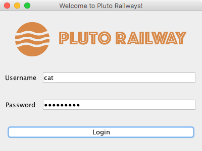
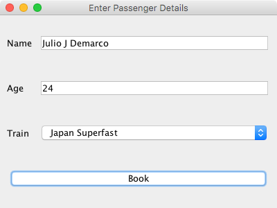

A GUI project in Java to understand Java Swings and Database Management.

## External software and libraries used:

- [IntelliJ IDEA](https://www.jetbrains.com/idea) - Java Integrated Development Environment
- [MySQL](https://www.mysql.com) - Open Source Relational Database Management System
- [iText PDF](https://itextpdf.com) - Creating and manipulating PDF files in Java and .NET

## How it works:

1. It connects to a locally hosted MySQL server at `jdbc:mysql://localhost:3306/` and looks for the database containing the user credentials.
2. If the credentials are correct, the user is granted access to the booking page. The ticket is created using the `iTextPDF PdfWriter` class.

## Special Thanks

A big thank you to everyone who helped in my project ❤️
