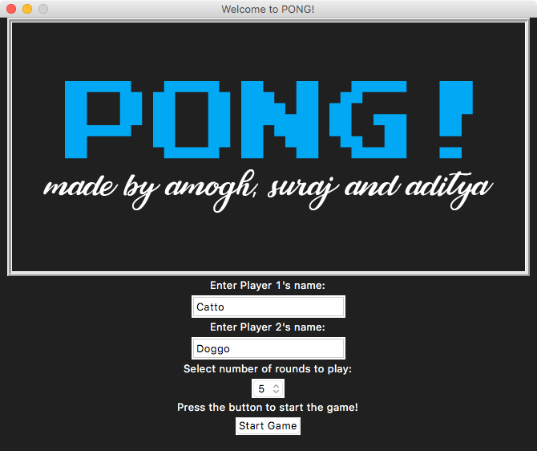
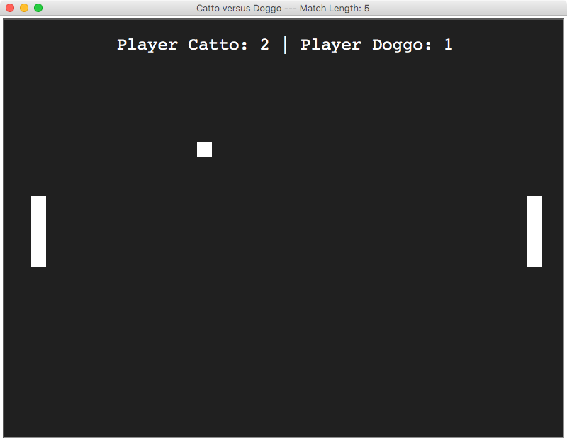
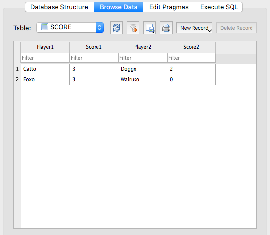

The classic Pong game written in Python, integrated with a GUI made in Tkinter and Database with SQLite

## Modules:

- [turtle module](https://docs.python.org/3.0/library/turtle.html) - Turtle graphics for Tk
- [tkinter module](https://docs.python.org/3/library/tk.html) - A robust and platform independent windowing toolkit
- [sqlite3 module](https://docs.python.org/3/library/sqlite3.html) - A C library that provides a lightweight disk-based database that doesn’t require a separate server process and allows accessing the database using a nonstandard variant of the SQL query language
- [Pong Game in Python Guide](https://www.youtube.com/watch?v=C6jJg9Zan7w) - A Pong clone game tutorial for beginners using Python 3

## media:

1. Ingame: `Player Catto against Player Doggo`

2. Scores Database: `A sample scores.db file`

## Other Details

This mini-project was created as a part of our Python Lab with my two friends Suraj Chodankar and Aditya Suvarna. A big thanks to our Python lecturer, Prof. Anuja Gote.
