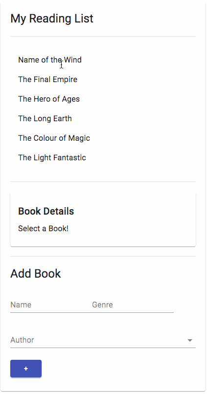

A Reading List written in React along with GraphQL, where you can you manage your books.

## Resources:

- [Create a New React App](https://reactjs.org/docs/create-a-new-react-app.html) - Get started with React here
- [Material-UI](https://material-ui.com/) - React components for faster and easier web development
- [Apollo GraphQL](https://www.apollographql.com/) - A single versatile query system to replace a patchwork of legacy APIs

## Available Scripts:

In the project/client directory, you can run: `yarn start`

Open [http://localhost:3000](http://localhost:3000) to view it in the browser.

In the project/server directory, you can run: `nodemon app.js`

Server will be running at [http://localhost:5000](http://localhost:5000).

---

This project was bootstrapped with [Create React App](https://github.com/facebook/create-react-app).
